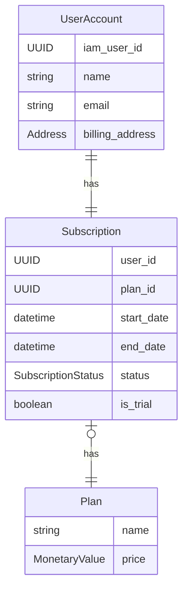
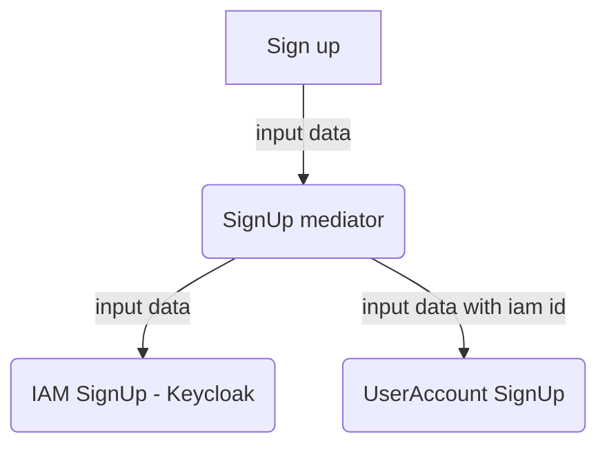
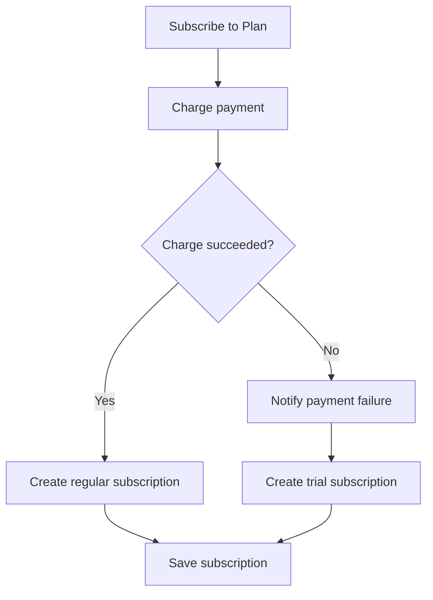
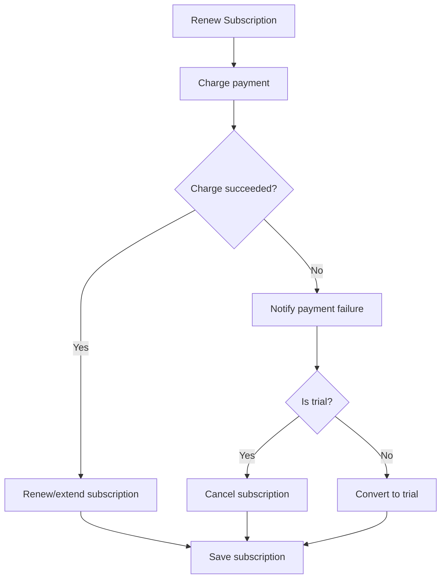

# codeflix-subscription-service
FullCycle 3.0 - Codeflix Final Project  - Subscription Service

# Subscription Service

## Entities

- Plan
  - name
  - price
- UserAccount
  - iam_user_id (external provider)
  - name
  - email
  - billing_address
- Subscription
  - user_id
  - plan_id
  - start_date
  - end_date
  - status (active, inactive)
  - is_trial

### ERD

## Use Cases
- Sign Up: User
- Subscribe to Plan: User
- Renew Subscription: System / User / Admin
- Cancel Subscription: User / Admin
- Create Plan: Admin

## Flowcharts

> Créditos ao @GSuaki pelos diagramas :)

### User Sign Up

### User Subscription

### Subscription Renewal

